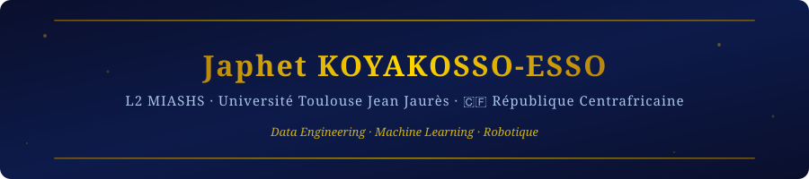

  

## 🧑‍💻 À propos de moi

- 🎓 Étudiant en **L3 MIASHS** (Mathématiques Informatiques Appliquées aux Sciences Humaines et Sociales) · UT2J Toulouse
- 🔍 En recherche d'une **alternance Développement / Data Engineering** (2026–2027)
- 🇨🇫 Originaire de la **République Centrafricaine**
- 💼 Stagiaire développeur web chez **Web-atrio** (HTML/CSS/JS · SQL · MySQL)
- 🎯 Objectif long terme : **Master Machine Learning / IA / Data Science**, puis carrière en ML appliqué
- 📜 Certifié **Développeur Python — Formation Complète 2026** (Udemy · 69,5h)
- 📊 En formation **Power BI** (Power Query · DAX · Power BI Service · préparation PL-300)

## 🛠️ Langages & Technologies

**Langages de programmation**

**Frameworks & Librairies**

**Bases de données**

**Outils, Environnements & BI**

---

## 🚀 Projets

### 🤟 [Signum HandSpeak](https://github.com/japhetkoyakossoesso-eng/Projet_Signum_HandSpeak_) *(2026)*
> Traduction de la langue des signes française (LSF) en temps réel via vision par ordinateur.
> 5 200 échantillons · Random Forest 100% de précision · LSTM pour gestes dynamiques · interface Tkinter · synthèse vocale · export PDF.
>
> **Stack :** Python · OpenCV · MediaPipe · scikit-learn · TensorFlow / LSTM · Tkinter  
> *Projet personnel · développé avec mon frère (infrastructure/sécurité)*

---

### 🌌 [Projet Galaxy](https://github.com/japhetkoyakossoesso-eng/Projet_galaxy) *(2026)*
> Jeu arcade Python/Kivy : endless runner pseudo-3D avec rendu en perspective, difficulté progressive, power-ups (pièces, boucliers, slow-motion), tuiles piégées, highscore persistant en JSON, effet de traînée du vaisseau.
>
> **Stack :** Python · Kivy  
> *Projet personnel*

---

### 🕹️ [Projet Kivy — Le Lab](https://github.com/japhetkoyakossoesso-eng/projet_kivy_lelab) *(2026)*
> Projet d'apprentissage et d'expérimentation du framework Kivy pour le développement d'interfaces graphiques mobiles/desktop en Python.
>
> **Stack :** Python · Kivy (kvlang)

---

### 🍕 [Pizza Django](https://github.com/japhetkoyakossoesso-eng/Pizza_Django) *(2026)*
> Application web back-end simulant le système de gestion d'une pizzeria : catalogue de pizzas stocké en base de données, rendu accessible via une interface web Django (MVT).
>
> **Stack :** Python · Django · HTML · CSS  
> *Déployé sur PythonAnywhere*

---

### 📊 [Student Grade Prediction](https://github.com/japhetkoyakossoesso-eng/projet_prediction_notes_avec_machine_learning) *(2026)*
> Pipeline ML complet pour prédire la note finale d'un étudiant en fonction de son comportement et engagement académique. Génération de dataset synthétique (`note_finale`, `mention`), EDA (8 visualisations), modélisation (Random Forest, régression logistique), interprétabilité, rapport RMarkdown.
>
> **Stack :** Python · scikit-learn · Pandas · Matplotlib · R · RMarkdown

---

### 🌐 [Mon Portfolio](https://github.com/japhetkoyakossoesso-eng/Mon_porfolio) *(2026)*
> Portfolio personnel développé en HTML/CSS pour présenter mes projets et compétences.
>
> **Stack :** HTML · CSS

---

### 🔐 [Projet Backdoor](https://github.com/japhetkoyakossoesso-eng/projet_backdoor) *(2026)*
> Projet éducatif de cybersécurité : implémentation d'un backdoor TCP socket en Python (shell distant, téléchargement de fichiers, capture d'écran) pour comprendre les mécanismes d'attaque et de défense.
>
> **Stack :** Python  
> *Projet éducatif uniquement*

---

### 🌿 [Qualité de l'Air en Occitanie](https://github.com/japhetkoyakossoesso-eng/Projet_Qualit-_de_l_Air_En_Occitanie) *(2025–2026)*
> Base de données SQLite normalisée (5 tables liées par code INSEE), pipeline ETL Python avec exports CSV, 15 requêtes SQL couvrant 5 problématiques. Rapport RMarkdown complet. **Note : 18,83/20.**
>
> **Stack :** Python · SQLite · SQL · R · RStudio · RMarkdown  
> *Projet académique · Groupe 8 · UT2J*

---

### 🍽️ [Organisation de Repas de Groupe](https://github.com/japhetkoyakossoesso-eng/Projet_ingSI_2) *(2025–2026)*
> Application pour organiser un repas de promotion : saisie des promesses d'apport (nom, prénom, catégorie, quantité), gestion des participants et répartition des contributions.
>
> **Stack :** Python · Tkinter  
> *Licence Apache 2.0*

---

### 🧠 [Quiz — John von Neumann](https://github.com/japhetkoyakossoesso-eng/ProjetWeb-quiz-sur-un-c-l-bre) *(2025–2026)*
> Application web complète et responsive dédiée à **John von Neumann**, père de l'architecture des ordinateurs modernes. Développée en solo en 3 étapes progressives (maquette → CSS → JavaScript dynamique).
>
> - **4 pages** : accueil, biographie, œuvre, quiz interactif
> - **Quiz 10 questions** : tableau d'objets JS, scoring automatique, 5 niveaux de feedback personnalisés, explications détaillées par question, validation des entrées, bouton recommencer
> - **Design responsive** Bootstrap 5.3 (mobile · tablette · desktop), palette de couleurs de la carte "Machines & Composants" (`#281B1C`), animations CSS (`@keyframes`, transitions, scroll automatique)
> - **Validé W3C** HTML5 & CSS3 · testé sur Chrome, Firefox, Edge, Safari · déployé sur le serveur de l'UT2J
>
> **Stack :** HTML5 · CSS3 · JavaScript ES6+ · Bootstrap 5.3  
> *Projet académique solo · UE Client Web · UT2J · Note obtenue en L2*

---

### 🌱 [Ma Semaine Verte](https://github.com/japhetkoyakossoesso-eng/ma_semaine_verte) *(2026)*
> Application web HTML/CSS sur la thématique du développement durable et des habitudes éco-responsables.
>
> **Stack :** HTML · CSS

---

### 📈 [Développement App Web — Bibliothèque Chart.js](https://github.com/japhetkoyakossoesso-eng/developpement_app_web_biblio_chart) *(2025–2026)*
> Application web de visualisation de données d'inscriptions étudiantes à l'UT2J (L2 MIASHS) via la bibliothèque Chart.js. Graphiques en barres et en courbes, multi-séries hommes/femmes, intégration de l'API OpenData du ministère de l'Enseignement Supérieur. Page individuelle avec comparaisons originales de données.
>
> **Stack :** JavaScript · HTML · CSS · Chart.js · REST API  
> *Projet académique en groupe · UT2J*

---

### 🎬 [Du Python au PHP](https://github.com/japhetkoyakossoesso-eng/Du_python_au_PHP) *(2026)*
> Projet de transition et d'apprentissage : cinémathèque web avec requêtes SQL JOIN, filtre par genre, formulaires d'ajout/suppression de films — passage du développement Python vers PHP/MariaDB.
>
> **Stack :** PHP · MariaDB · HTML · CSS

---

### 🤖 [Initiation à l'Apprentissage Automatique & IA Générative](https://github.com/japhetkoyakossoesso-eng/Initiation_A_Lapprentissage_automatique) *(2025–2026)*
> Projet académique pluridisciplinaire couvrant les fondements de l'intelligence artificielle moderne et symbolique.
>
> - **Analyse comparative de LLMs** : étude approfondie de ChatGPT (OpenAI), DeepSeek et Le Chat (Mistral) — approches d'apprentissage, sources d'entraînement, localisation des serveurs, accessibilité du code source, modalités d'utilisation
> - **IA symbolique avec Prolog** : implémentation d'une base de connaissances nutritionnelles (16 aliments, glucides/lipides/protides), requêtes logiques sur les laitages, protéines, composition de menus équilibrés et calcul de macronutriments
> - **Benchmark de modèles** : évaluation comparative via Comparia (beta.gouv.fr) — analyse des licences, estimation des paramètres, impact énergétique, modèles frugaux (taille XS vs XL)
> - **Modélisation des interactions Humain-Machine** : schémas d'architecture pour les échanges avec une IA générative vs un programme Prolog
>
> **Stack :** Prolog · Python · IA générative (ChatGPT · DeepSeek · Mistral)  
> *Projet académique · UE MI0C405T Introduction à l'IA · UT2J*

---

### 🧾 Excel Invoice Generator *(2026)*
> Outil Python d'automatisation de génération de factures clients à partir de fichiers Excel. Scan de dossier, validation de structure `.xlsx`, extraction et agrégation des commandes par client, génération automatique de factures individuelles.
>
> **Stack :** Python · openpyxl · os · datetime  
> *Projet personnel · développé en solo*

---

### 🚌 Tisseo API Web App *(2026)*
> Application web JavaScript/AJAX interrogeant l'API OpenData Tisseo pour afficher lignes et arrêts de transport en commun de Toulouse, avec déduplication via `Set`.
>
> **Stack :** JavaScript · HTML · CSS · AJAX · Chart.js · REST API

---

### 🏠 DomoHouse System *(2026)*
> Interface domotique Python/Tkinter avec thème clair/sombre, gestion de maisons et pièces, intégration Pillow pour le traitement d'images.
>
> **Stack :** Python · Tkinter · Pillow  
> *Projet groupe · UT2J*

---

## 💼 Expérience professionnelle

| Période | Poste | Structure |
|---------|-------|-----------|
| Oct. 2025 – Déc. 2026 | 💻 **Stagiaire Développeur Web** | Web-atrio (ESN, Toulouse) — HTML/CSS/JS, SQL/MySQL, correction de bugs, travail avec un développeur senior |

---

## 📊 GitHub Stats

## 📫 Me contacter

*« Code · Apprends · Compétis · Recommence »*

